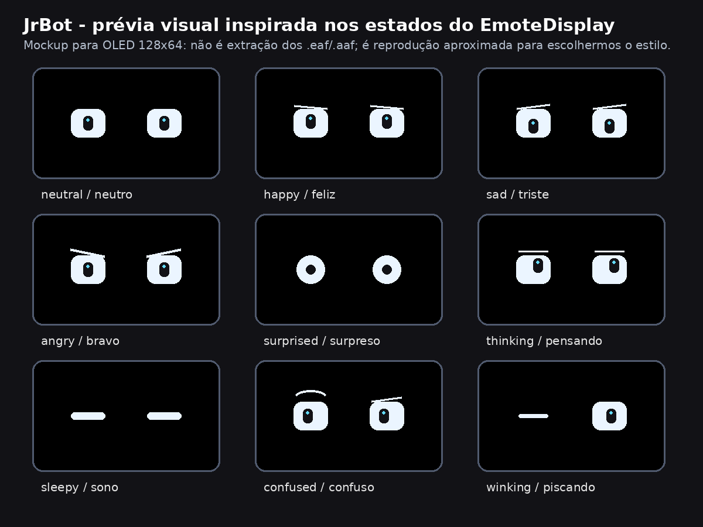

# JrRobot — Corpo Pablo ESP32

Firmware e ferramentas do **JrBot / Corpo Pablo**, um robô físico simples baseado em ESP32-S3. A primeira etapa do projeto é dar expressão ao robô usando um display OLED para o rosto; as próximas etapas incluem servo da cabeça, áudio/som, câmera e integração com IA.

> Status: protótipo funcional para rosto OLED no ESP32-S3, com Serial USB como modo principal de teste e Wi-Fi opcional.



## Visão do projeto

O objetivo é construir um corpo físico simples para o Pablo/JrBot:

- ESP32-S3 como controlador embarcado;
- rosto com olhos expressivos em display OLED 128x64;
- cabeça/pescoço com servo para olhar e acompanhar movimento;
- sistema de som/áudio modular;
- câmera ou visão externa para detectar/acompanhamento humano;
- integração futura com IA/OpenClaw ou cérebro embarcado no próprio ESP32-S3.

A filosofia do projeto é começar pequeno, testável e seguro: primeiro rosto, depois movimento, depois áudio e inteligência.

## O que já existe

- Firmware ESP-IDF para ESP32-S3.
- Rosto OLED com expressões básicas.
- Comandos via Serial.
- Wi-Fi configurável localmente sem subir senha para o GitHub.
- API/painel web simples no ESP32 após conectar ao Wi-Fi.
- Scripts `.bat` para facilitar instalação no Windows.
- Documentação inicial de pinagem e plataforma.

## Hardware testado até agora

- Placa ESP32-S3 usada pelo Junior.
- Display OLED I2C 128x64.
- Endereço OLED detectado/testado: `0x3C` e fallback para `0x3D`.
- Pinagem OLED validada no teste físico:
  - `VCC` → `3V3`
  - `GND` → `GND`
  - `SDA` → `GPIO1`
  - `SCL` → `GPIO2`

Atenção: antes de soldar ou alimentar módulos maiores, validar tensão, corrente e GND comum. Servo, motor, amplificador e bateria não devem ser alimentados diretamente pelo pino `3V3` do ESP32.

## Arquivos principais para uso rápido

Na maioria dos testes no Windows, use estes arquivos:

- `CONFIGURAR_WIFI.bat` — grava nome/senha do Wi-Fi no firmware local, sem publicar segredo.
- `INSTALAR.bat` — compila, grava o ESP32-S3 e abre o painel local no final.
- `PAINEL.bat` — pergunta se abre por Serial USB ou Wi-Fi. Por enquanto use a opção 1, Serial USB.
- `DIAGNOSTICO.bat` — gera `erro-build.txt` se a compilação falhar.

## Instalação rápida com Wi-Fi

Pré-requisito: abrir o terminal **ESP-IDF Command Prompt** no Windows.

1. Extraia o ZIP ou clone o projeto em uma pasta simples.
2. Entre na pasta do projeto.
3. Configure o Wi-Fi local:

```powershell
.\CONFIGURAR_WIFI.bat
```

4. Grave o firmware no ESP32-S3:

```powershell
.\INSTALAR.bat COM6
```

Se a porta de gravação não for `COM6`, troque pelo COM correto.

Depois de iniciar, o log serial deve mostrar algo parecido com:

```text
JR_WIFI conectado ip=192.168.0.xxx
```

Então abra no navegador:

```text
http://IP_DO_ESP32/
```

Exemplo:

```text
http://192.168.0.83/
```

## Painel local do computador

Depois de instalado, para abrir o painel:

```powershell
.\PAINEL.bat
```

Agora existe uma tela única no computador:

```text
http://127.0.0.1:8765
```

Na própria tela você escolhe o modo:

- `Serial USB`: configurar, diagnosticar e testar pela COM.
- `Wi-Fi`: controlar pelo IP do ESP32, usando a mesma tela e os mesmos botões.

### Configurar Wi-Fi pelo painel único

1. Abra `PAINEL.bat`.
2. Na tela única, deixe `Serial USB` selecionado.
3. Clique em `Atualizar portas`, escolha a COM e clique em `Conectar Serial`.
4. No bloco `Configurar Wi-Fi pelo Serial`, preencha nome da rede e senha.
5. Clique em `Configurar Wi-Fi no ESP32`.
6. Aguarde no log a linha `JR_WIFI conectado ip=...`.
7. Copie esse IP para o campo `IP Wi-Fi`.
8. Selecione `Wi-Fi` no topo da mesma tela.
9. Clique em `testar Wi-Fi` ou use os botões de rosto normalmente.

No teste do Junior o IP entregue pelo roteador foi `192.168.0.83`. Isso é DHCP normal. `192.168.0.50` era apenas sugestão antiga para IP fixo.

## Comandos do rosto

Comandos disponíveis nesta fase:

```text
neutro, feliz, triste, bravo, animado, surpreso, pensando, cetico,
sono, confuso, piscando, amor, brincalhao, preocupado, cool,
bateria, demo, status, help
```

## Estrutura do repositório

```text
firmware/              Firmware ESP-IDF do ESP32-S3
firmware/core/         Wi-Fi, configuração e comandos
firmware/module_face/  Rosto OLED e expressões
firmware/module_portal/ API e painel web no ESP32
docs/                  Pinagem, plataforma e decisões técnicas
scripts/               Scripts auxiliares de empacotamento/deploy
tools/                 Ferramentas locais de apoio
previews/              Imagens de prévia do projeto
references/            Referências antigas/arquitetura para consulta
```

## Roadmap inicial

- [x] Validar OLED I2C no ESP32-S3.
- [x] Criar primeiras expressões do rosto.
- [x] Adicionar configuração Wi-Fi local sem expor credenciais.
- [x] Expor painel/API web simples no ESP32.
- [ ] Organizar documentação pública para colaboradores.
- [ ] Adicionar servo da cabeça/pescoço com PWM seguro.
- [ ] Criar comandos `olhar_esquerda`, `olhar_direita`, `centro`.
- [ ] Definir alimentação segura para ESP32 + servo + módulos.
- [ ] Adicionar sistema de áudio/som.
- [ ] Integrar câmera ou processamento externo para acompanhar humano.
- [ ] Avaliar cérebro local inspirado em projetos como MimiClaw.

## Segurança e credenciais

Este projeto não deve receber senhas, tokens, chaves privadas ou credenciais reais no GitHub.

Arquivos locais ignorados:

- `credencial/`
- `.env`
- `*.secret`
- `secrets.*`
- `firmware/main/wifi_config.local.h`

Para colaboração pública, use exemplos e placeholders. Configurações reais ficam somente na máquina/dispositivo de quem está testando.

## Como contribuir

Contribuições são bem-vindas, principalmente em:

- desenho de expressões OLED;
- controle de servo e movimento da cabeça;
- alimentação segura e montagem física;
- áudio/I2S/TTS;
- câmera e detecção/acompanhamento humano;
- documentação para iniciantes;
- testes em placas ESP32-S3 diferentes.

Antes de propor alteração grande, abra uma issue descrevendo a ideia, hardware usado e riscos de ligação elétrica.

## Licença

Licença ainda não definida. Antes de tornar o repositório público com colaboradores externos, é recomendado adicionar uma licença aberta, por exemplo MIT, Apache-2.0 ou GPL-3.0.

## Créditos

Projeto iniciado por Junior para o Corpo Pablo/JrBot, com desenvolvimento incremental focado em protótipos físicos simples, seguros e testáveis.


## Teste da câmera pelo painel

Nesta versão o painel local (`PAINEL.bat`) ganhou a área **Camera**.

Fluxo de teste:

1. Grave o firmware no ESP32-S3 CAM N16R8.
2. Conecte o JrBot no Wi-Fi e copie o IP mostrado no log.
3. Abra `PAINEL.bat`.
4. Selecione **Wi-Fi** e informe o IP do ESP32.
5. Clique em **📷 Focar e tirar foto**.

O painel chama `http://IP_DO_ESP32/capture?focus=1` e mostra a foto capturada pela OV5640 na própria tela.
Também existe o portal direto no ESP32 em `http://IP_DO_ESP32/`, com botões de foto, autofocus e foco manual.
