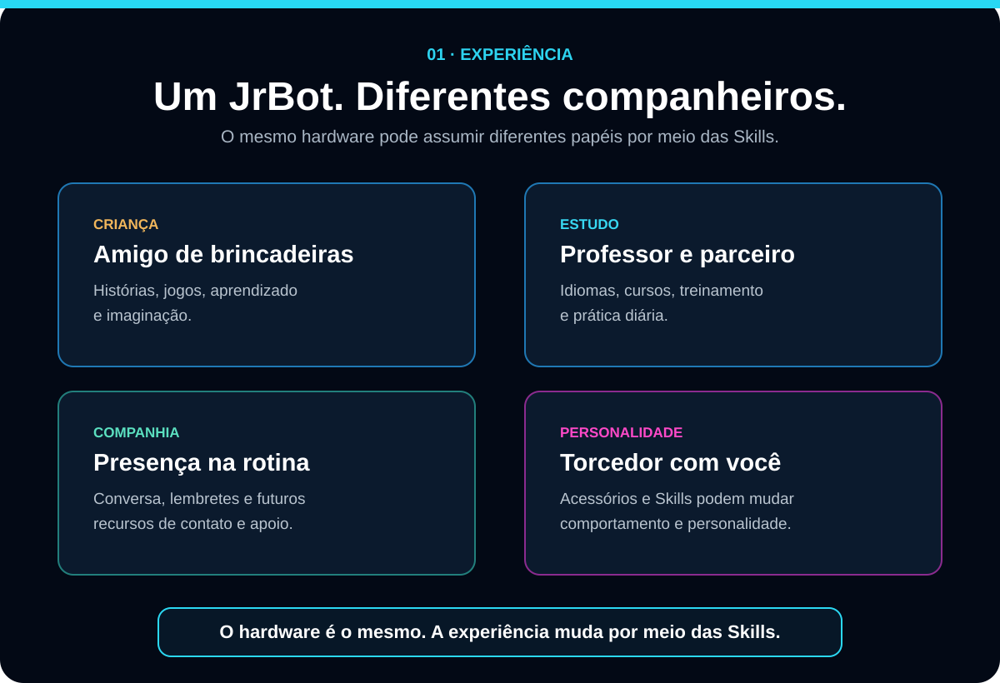

# JrBot

<p align="center">
  
</p>

**Uma IA que deixa de ser apenas uma ferramenta e passa a ser presença.**

O JrBot é um projeto em desenvolvimento que une inteligência artificial, voz, expressão digital e presença física. A proposta é ir além de um assistente que apenas responde perguntas: o objetivo é criar uma experiência mais próxima, expressiva, personalizada e progressivamente offline.

> **O JrBot não foi criado apenas para responder. Foi criado para estar com você.**

**Ouve · Entende · Responde · Reage · Expressa**

## Visão do projeto

A visão de longo prazo é desenvolver um robô capaz de ouvir o usuário, reconhecer quando é chamado, conversar por voz, perceber o ambiente por câmera, demonstrar expressões, manter contexto e memória e receber novas capacidades por meio de Skills.

O objetivo não é simular sentimentos humanos reais, mas criar uma experiência de presença por meio de **voz, expressão, contexto, personalidade e continuidade**.

## Um JrBot. Diferentes companheiros.

<p align="center">
  
</p>

O mesmo hardware poderá assumir experiências diferentes conforme personalidade, contexto e Skills:

- **Crianças:** histórias, jogos, aprendizado e brincadeiras.
- **Estudos:** idiomas, exercícios, revisão e prática diária.
- **Companhia:** conversa, lembretes e presença na rotina.
- **Entretenimento:** experiências temáticas, jogos e personalidades.

## Plataforma de Skills

O robô físico é a interface. A visão de longo prazo é construir um ecossistema em que uma Skill possa adicionar uma habilidade, personalidade, conteúdo educacional, integração ou serviço sem transformar todo o firmware em um único bloco.

Categorias futuras podem incluir educação, idiomas, companhia, entretenimento, marcas, serviços e integrações. Acessórios físicos com tecnologias como NFC ou RFID também poderão ativar Skills ou personalidades específicas.

> Skills, marketplace e acessórios inteligentes fazem parte da visão futura e não representam funcionalidades já concluídas.

## Estado atual

| Etapa | Objetivo | Estado |
| --- | --- | --- |
| **V0** | Hardware, periféricos, painel de desenvolvimento e testes | **Aprovada em `main`** |
| **V1** | Controle pelo navegador na rede local | **Em desenvolvimento em `v1`** |
| **V2** | Controle por voz local | **Linha preservada em `v2`, pausada até fechar V1** |
| **V3** | Controle programático pela Runtime API | Planejada |
| **JrBrain** | Memória, personalidade, relacionamento, LLM e Skills | Posterior |

### V0 — fundação aprovada

A V0 consolidou ESP32-S3 N16R8, OLED SSD1306, áudio MAX98357A, microfone MS3625, câmera OV5640, Wi-Fi, painel de desenvolvimento e a base inicial da Runtime API. A baseline técnica promovida em `main` é `JRBotV2_RUNTIME_API_V1_02`, com Runtime API compatível `1.1`.

### V1 — etapa ativa

A V1 transforma essa base técnica na primeira experiência de produto:

```text
PC / celular
    ↓
http://IP_DO_JRBOT/
    ↓
painel interno do ESP32-S3
    ↓
capabilities seguras
    ↓
JrBot físico
```

A linha oficial da versão é `v1`, com integração em `develop` pelo PR #20.

## Roadmap oficial

```text
V0  Fundação de hardware e periféricos
 ↓
V1  Controle pelo navegador / IP local
 ↓
V2  Controle por voz local
 ↓
V3  Controle programático pela Runtime API
 ↓
JrBrain  Memória + personalidade + LLM + relacionamento
 ↓
Skills / plataforma / ecossistema
```

O detalhamento oficial fica em [`docs/ROADMAP.md`](docs/ROADMAP.md).

## Arquitetura

```text
V1 painel web ─┐
V2 voz        ─┼─> capability registry -> hardware
V3 API        ─┘

Depois:
JrBrain -> Action Router -> mesmas capabilities
```

A IA não controla GPIO diretamente. O firmware expõe ações limitadas e validadas.

## Desenvolvimento

As branches oficiais de trabalho são:

```text
main    = última versão aprovada
develop = integração entre versões
v1      = JrBot V1, linha ativa
v2      = JrBot V2, linha preservada/pausada
```

As revisões de firmware (`_V1_02`, `_V1_03`, etc.) são controladas por commits e marcadores de versão dentro da branch da versão de produto. Não é criada uma branch nova para cada candidata. Branches `archive/*` são somente histórico.

A versão em desenvolvimento entra em `develop` por Pull Request e só depois é promovida para `main` quando estiver suficientemente validada.

## Documentação

- [Roadmap](docs/ROADMAP.md)
- [Estado do projeto](docs/PROJECT_STATUS.md)
- [Arquitetura](docs/ARCHITECTURE.md)
- [Desenvolvimento](docs/DEVELOPMENT.md)
- [Runtime API](docs/API_RUNTIME.md)
- [Testes](docs/TESTING.md)

## Contribuição

Leia [`CONTRIBUTING.md`](CONTRIBUTING.md) e consulte as Issues abertas antes de iniciar uma mudança.

Contribuições aceitas são disponibilizadas sob a mesma **MIT License** do projeto.

## Licença

O conteúdo original deste repositório é disponibilizado sob a [MIT License](LICENSE), salvo indicação explícita em contrário. Isso permite uso, modificação, distribuição e uso comercial, preservados os avisos exigidos pela licença.

Dependências e componentes de terceiros continuam sujeitos às respectivas licenças.

A licença do código não concede automaticamente direito de apresentar produtos derivados como oficiais nem direitos sobre a marca **JrBot**.

## Status

**Projeto em desenvolvimento ativo.** Para distinguir o que está implementado, compilado, testado ou validado fisicamente, consulte [`docs/PROJECT_STATUS.md`](docs/PROJECT_STATUS.md).

<p align="center">
  <strong>JrBot</strong><br>
  Ouvir. Entender. Responder. Reagir. Expressar.<br><br>
  <em>Project by JrTk Invest</em>
</p>
