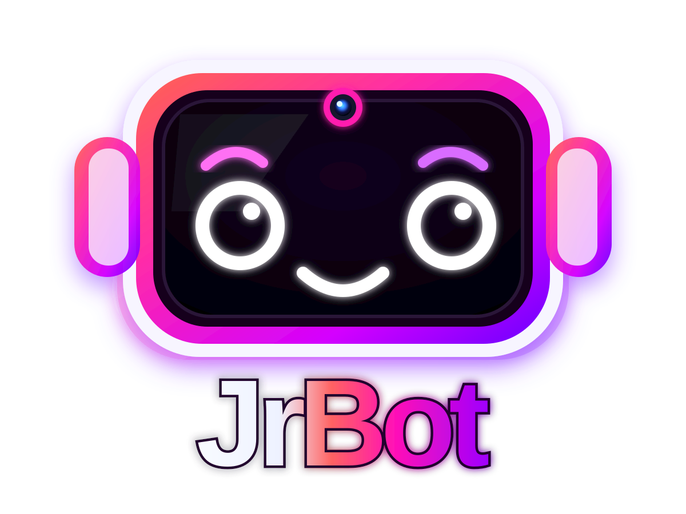

# JrBot

**Open-source Physical AI Robot powered by ESP32-S3**  
See. Hear. Speak. Connect. Express.

[Website](https://jrbot.com.br) ·
[Build your own](#build-your-own-jrbot) ·
[Documentation](docs/README.md) ·
[Roadmap](docs/ROADMAP.md) ·
[Contribute](CONTRIBUTING.md) ·
[JrSkill Network](docs/HACKATHON_DEVLOG.md)

  

## AI is leaving the screen.

Most AI assistants live inside a browser, phone or computer.

**JrBot explores a different idea: what happens when AI has a physical presence?**

JrBot is an open-source robot built around the **ESP32-S3**. It combines vision, audio, an expressive OLED face, Wi-Fi and real-time communication in a platform designed to evolve toward local voice control, memory, personality, Skills and remote connectivity.

> **JrBot was not created only to answer. It was created to be there.**

The current stable release is **JrBot_V1.7.04**.

## What JrBot does

| Capability | Current implementation |
| --- | --- |
| **See** | OV5640 camera with photo capture, browser preview and Live video |
| **Hear** | MS3625 I2S microphone with recording and WebRTC audio |
| **Speak** | MAX98357A audio output, playback and audio received from phone/computer |
| **Express** | SSD1306 OLED face with selectable expressions |
| **Connect** | Wi-Fi, local HTTPS, responsive web interface and WebRTC |
| **Interact** | Direct control from phone or computer on the local network |

The intelligence layers are evolving on top of this physical foundation. Stable V1 focuses on the connected robot platform; local voice, programmatic capabilities, JrBrain and Skills evolve in dedicated project lines.

## What works today

**Stable release: JrBot_V1.7.04**

The current HW04 baseline has been physically validated with:

- ✅ ESP32-S3 firmware;
- ✅ OV5640 camera;
- ✅ expressive SSD1306 OLED face;
- ✅ MS3625 microphone;
- ✅ MAX98357A speaker output;
- ✅ mobile and desktop web interface;
- ✅ local HTTPS;
- ✅ microphone recording and playback;
- ✅ real I2S full-duplex with shared BCLK and WS;
- ✅ bidirectional WebRTC Live audio;
- ✅ OV5640 JPEG video over WebRTC DataChannel/SCTP;
- ✅ centralized mode and I2S resource management.

In the final V1.7.04 physical validation, microphone, playback and Live acquired and released I2S through the central resource manager, ownership returned to none, WebRTC connected and stopped normally, and no reset/watchdog was observed.

**Current limitation:** Live is local-network only. Internet connectivity, STUN/TURN and remote signaling remain future work.

## Build your own JrBot

JrBot is designed to be built, modified and extended.

### Reference hardware

| Component | Role |
| --- | --- |
| **ESP32-S3 N16R8** | Main controller |
| **OV5640** | Camera |
| **SSD1306 OLED** | Face and expressions |
| **MS3625 I2S** | Microphone |
| **MAX98357A** | Audio amplifier |
| **Speaker** | Audio output |
| **Wi-Fi** | Local connectivity |

### HW04 shared I2S wiring

| Signal | GPIO |
| --- | ---: |
| BCLK / SCK | 21 |
| WS / LRCLK | 47 |
| MS3625 SD | 41 |
| MAX98357A DIN | 42 |

BCLK and WS are intentionally shared between microphone RX and amplifier TX.

### Firmware installation

For the current Windows development flow:

1. Clone or download this repository.
2. Connect the ESP32-S3 through USB.
3. Run **INSTALAR.bat** from the repository root.
4. Follow the installer/flash flow.
5. Confirm the firmware version in the device log/status after installation.

For development details, see the [Development Guide](docs/DEVELOPMENT.md) and [Testing Guide](docs/TESTING.md).

## Architecture at a glance

~~~text
Phone / computer
        |
      Wi-Fi
        |
 local web interface
        |
    ESP32-S3
    /   |   \
 OLED camera audio
             |
      microphone + speaker
~~~

The current firmware keeps physical resources controlled by explicit subsystems. A unified capability layer continues to evolve so future Skills and AI layers can request safe operations without exposing raw GPIO or arbitrary native execution.

## Active project lines

JrBot keeps hardware stability, experimental milestones and future product work clearly separated. The **JrBot_V1.7.04** release remains the physically validated local-control baseline, while **JrBot_V1S_APP_03** is the separately validated JrSkill / Solana Devnet MVP build. Integrating source history is not, by itself, a new Mainnet or stable-firmware certification.

| Line | Purpose | Status |
| --- | --- | --- |
| **main** | Official source integration and releases | V1.7.04 validated local baseline; V1S MVP integration |
| **develop** | Validated future work | Integration line |
| **V1s-00** | JrSkill Network / Colosseum 2026 | **MVP achieved — 2026-10-10; historical development branch** |
| **v2** | Local voice control | Independent product line |
| **v1** | Earlier V1 reference | Historical |

### Colosseum 2026 — MVP achieved

In nearly two weeks, the hackathon development built a new **Solana-based Skill economy layer** around the existing open-source JrBot: a web Creator Studio, bilingual JrSkill Store, HTTPS Cloud API, Skill/Offer/License accounts on Devnet, wallet purchasing, and licensed physical Skill execution.

The original reference Skill and a second independent Skill (`jrteste`) were created/purchased and validated through the complete creator → Store → Phantom Wallet → Solana Devnet → licensed JrBot flow. The maintainer confirmed physical execution of `jrteste` on 2026-10-07 using `JrBot_V1S_APP_03` and panel `JRBOT-PANEL-V1S-SKILLS-15`.

**The MVP is complete; the JrSkill Network vision continues.** The global marketplace and a next development line remain future work, not a Mainnet launch, proof of external adoption or an assertion of absolute security.

- [Complete Colosseum timeline — Kickoff and Day 1–9](docs/HACKATHON_DEVLOG.md)
- [Day 8 — Store, transactions, test evidence and hardware execution](docs/HACKATHON_DEVLOG/day8.md)
- [Day 9 — MVP victory and global Skill economy vision](docs/HACKATHON_DEVLOG/day9.md)
- [JrSkill Execution API — design and history](docs/JRSKILL_API.md)
- [Embedded My Skills App / physical validation](docs/JRSKILL_APP.md)
- [Issue #33](https://github.com/JuniorNarciso26/JrRobot/issues/33) · [Colosseum project](https://colosseum.com/arena/projects/jrskill-network)

## JrBot V1 — current stable capabilities

### Control from phone or computer

JrBot serves its own web interface directly from the ESP32-S3. On the same local network, users can access the robot from a browser without depending on the Python development panel.

The interface supports desktop and mobile use and exposes the robot's main functions and diagnostics.

### Expressive OLED face

The SSD1306 OLED acts as JrBot's digital face.

The current interface can:

- select expressions;
- change the face in real time;
- report the active expression;
- provide the visual foundation for future emotional and behavioral responses.

### OV5640 camera

Current camera features include:

- photo capture;
- browser preview;
- Live camera mode;
- QVGA, VGA and SVGA resolutions;
- JPEG quality adjustment;
- FPS and frame-size metrics;
- physically confirmed camera orientation at -90° / 270°.

### Microphone and audio

The MS3625 microphone and MAX98357A output support:

- microphone recording;
- selectable recording duration within defined limits;
- WAV playback in the browser;
- download of recorded audio;
- replay through JrBot's speaker;
- received audio messages;
- volume adjustment;
- audio tests and diagnostics.

### Full-duplex WebRTC Live

The main real-time communication flow in V1.7.04 is a bidirectional local Live session.

When Live starts:

- MS3625 sends audio from JrBot to the browser through WebRTC;
- the phone microphone sends audio to MAX98357A through WebRTC;
- OV5640 sends JPEG frames through a DataChannel in the same session;
- I2S BCLK and WS remain shared between RX and TX;
- either audio direction can be muted without ending the session.

The current transport was physically validated on the local network and is designed to leave room for future Internet WebRTC evolution.

### Resource management

V1.7.04 consolidates the first central runtime control for the validated HW04 baseline:

- central jr_mode_manager;
- central jr_resource_manager;
- explicit I2S ownership for mic, playback and Live;
- telemetry for acquisitions, releases, busy events and release mismatches;
- memory/PSRAM policy preserved so ICE/DTLS/SCTP, camera and audio can operate together.

### Wi-Fi and local HTTPS

The stable V1 flow includes:

- DHCP by default;
- automatic IP assignment;
- Wi-Fi status and diagnostics;
- persisted network configuration;
- reconnection support;
- local HTTPS for modern browser features such as microphone access, getUserMedia and MediaRecorder.

## What makes JrBot different

JrBot is not only a chatbot placed inside a robot shell.

The project is building the physical layers first:

**camera → eyes**  
**microphone → ears**  
**speaker → voice**  
**OLED → expression**  
**WebRTC → real-time presence**  
**Skills → future abilities**

This makes it possible to evolve intelligence without discarding the physical platform already validated in V1.

## JrSkill Network — verified Skills, real-world execution

The JrSkill MVP demonstrates how robot behavior can be declared as portable JSON and licensed through Solana Devnet. The complete demonstrated architecture connects the **Creator Studio + Store (`JrBot_Web`)**, **Cloud API (`JrBot_Cloud`)**, **Phantom / Wallet Standard**, **Skill/Offer/License accounts** and **My Skills** in the embedded JrBot App.

~~~text
Creator Studio: Skill JSON v1
        |
Store: publish Skill + Offer
        |
Solana Devnet: wallet purchase + License
        |
JrBot App: discover + verify licensed Skill
        |
Controlled Executor / Runtime API
        |
Physical JrBot: authorized face / wait actions
~~~

The first physically tested MVP scope intentionally uses controlled OLED expressions and waits. The browser/service layers handle blockchain communications; **Solana data and third-party Skills never receive arbitrary GPIO, driver, native-code or shell execution rights on the ESP32**.

The 2026 Devnet proof included a 1 **test SOL** purchase with a 50/50 creator/project allocation. This demonstrates a proposed creator-economy mechanism, not real Mainnet income. For source evidence, transaction references, limitations and the timeline, see the [hackathon development log](docs/HACKATHON_DEVLOG.md).

## Product status

| Version / line | Goal | Status |
| --- | --- | --- |
| **V0** | Hardware and peripheral foundation | Completed |
| **V1** | Human control through browser and local media | **Completed — JrBot_V1.7.04** |
| **V1S / JrSkill Network** | Declarative Skill distribution, Wallet licenses and physical execution via Solana | **Devnet MVP achieved; APP_03 physically validated** |
| **V2** | Local voice control | Next product line |
| **V3** | Programmatic control through Runtime API | Planned |
| **JrBrain** | Memory, personality, context, LLM and Skills | Future |

## Roadmap

~~~text
V1 — browser and local control
 |
V2 — local voice
 |
V3 — programmatic control
 |
JrBrain — memory + personality + LLM
 |
Skills / platform / ecosystem
~~~

**The JrSkill Network hackathon MVP has been demonstrated and documented.** Its Devnet licensing/execution layer complements the stable V1 product; broader commercial deployment and further Skills belong to a separately planned next stage.

See the full [Roadmap](docs/ROADMAP.md).

## Contributing

JrBot welcomes contributors interested in:

- ESP32-S3 / ESP-IDF;
- embedded systems;
- audio and DSP;
- I2S and echo/AEC research;
- WebRTC and networking;
- frontend and mobile interfaces;
- camera and computer vision;
- electronics and hardware;
- mechanical design / 3D printing;
- testing and documentation;
- AI / JrBrain;
- Solana / JrSkill Network.

You do not need to understand the whole robot or own complete hardware to contribute. Documentation, tools, frontend work and isolated proofs can be useful contributions.

### Development process

JrBot tries to preserve an understandable technical history:

~~~text
Idea
  |
Research
  |
Issue
  |
Architecture
  |
Isolated branch / proof
  |
Physical test
  |
Documentation
  |
Integration
  |
develop
  |
release
~~~

Start with the [Contribution Guide](CONTRIBUTING.md) and the [open Issues](https://github.com/JuniorNarciso26/JrRobot/issues).

## Development and documentation

### Main references

- [Documentation index](docs/README.md)
- [Roadmap](docs/ROADMAP.md)
- [Project status](docs/PROJECT_STATUS.md)
- [Architecture](docs/ARCHITECTURE.md)
- [Development guide](docs/DEVELOPMENT.md)
- [Runtime API](docs/API_RUNTIME.md)
- [Testing](docs/TESTING.md)
- [Contributing](CONTRIBUTING.md)

### Main branches

| Branch | Role |
| --- | --- |
| **main** | Latest officially promoted release |
| **develop** | Integration of validated future work |
| **V1s-00** | Completed JrSkill / Solana MVP; preserves Colosseum development history |
| **v1** | Historical V1 reference |
| **v2** | JrBot V2 local voice line |

## License

Original content in this repository is released under the [MIT License](LICENSE), unless explicitly stated otherwise.

The MIT License allows use, modification, distribution and commercial use subject to its notice requirements.

Accepted contributions are released under the same MIT License as the project. Third-party dependencies and components remain subject to their own licenses.

The software license does not automatically grant the right to present derived products as official JrBot products or grant rights to the **JrBot** trademark.

## Vision

JrBot starts as a controllable, expressive and connected physical robot.

The long-term vision is a physical digital presence capable of listening, talking, perceiving the environment, maintaining continuity and receiving new abilities without losing interaction simplicity.

  <strong>JrBot</strong> 
  Listen. Understand. Respond. React. Express.  
  <em>Project by JrTk Invest</em>

---

  If you want to follow the evolution of open-source physical AI, consider starring the repository.

