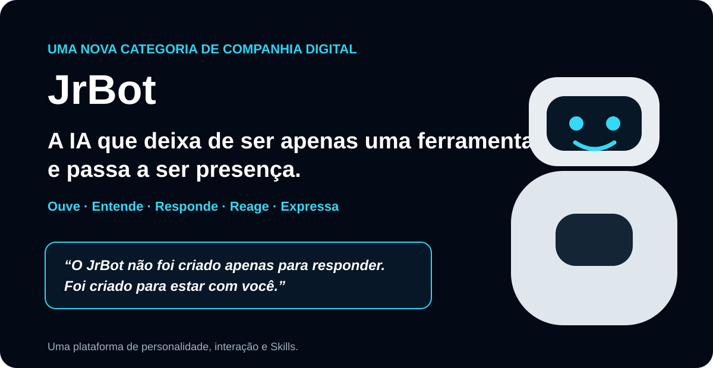

# JrBot

<p align="center">
  
</p>

**An AI that moves beyond being just a tool and becomes a physical presence.**

**JrBot** is an open-source physical AI robot based on the ESP32-S3. It combines an expressive OLED face, camera, microphone, speaker, Wi-Fi, a local web interface and real-time communication, while evolving toward local voice control, memory, personality, Skills and remote connectivity.

The current stable release is **`JrBot_V1.7.04`**.

> **JrBot was not created only to answer. It was created to be there.**

<p align="center">
  <strong>Open-source ESP32-S3 robot with voice, camera, WebRTC, expressive OLED face and an evolving AI architecture.</strong>
</p>

## JrSkill Network — official parallel line

**JrSkill Network (V1S)** is an official parallel line of the JrBot project focused on portable, declarative Skills for physical AI.

Its objective is to study an architecture where Skills can be published, versioned and licensed through **Solana**, while execution remains protected by a local Skill Executor and controlled JrBot capabilities. Blockchain data must never gain direct access to GPIO, drivers or arbitrary native code on the ESP32.

This line is intentionally separated from the stable product release:

- stable product: **`JrBot_V1.7.04`** on `main`;
- JrSkill / Solana line: **`JrBot_V1S_00`** on `V1s-00`;
- local voice line: `v2`.

Detailed development stages, experiments, proofs and implementation notes for JrSkill Network are maintained **only in the `V1s-00` branch** until that work is intentionally integrated into the main product.

**Branch:** [`V1s-00`](https://github.com/JuniorNarciso26/JrRobot/tree/V1s-00)  
**Technical context:** [Issue #33](https://github.com/JuniorNarciso26/JrRobot/issues/33)  
**Colosseum:** https://colosseum.com/arena/projects/jrskill-network

## Contributing to JrBot

**JrBot is open source** and welcomes contributions from people interested in robotics, embedded systems, audio, computer vision, interfaces and artificial intelligence.

You do not need to understand the entire project or own a complete JrBot to contribute. Documentation, tests, frontend work, tooling and isolated firmware improvements can all be developed and reviewed independently.

### Areas where you can help

- **ESP32-S3 / ESP-IDF** — firmware, drivers, memory, Wi-Fi and embedded architecture;
- **Audio and DSP** — I2S, full-duplex, echo/AEC, codecs and voice processing;
- **WebRTC and networking** — real-time communication, signaling and remote-access evolution;
- **Frontend** — responsive web UI, mobile experience and diagnostic tools;
- **Camera and vision** — OV5640, capture, streaming and future computer-vision capabilities;
- **Electronics and hardware** — power, audio, sensors, boards and integration reviews;
- **Mechanical design / 3D printing** — body, mounts, fittings and physical evolution;
- **Testing and documentation** — automated tests, technical documentation, guides and examples;
- **AI / JrBrain** — future memory, personality, context, LLM and Skills architecture;
- **Solana / JrSkill Network** — wallet integration, PDA design, Skill schema and on-chain distribution.

### How to start

1. Read the [contribution guide](CONTRIBUTING.md) and the [technical documentation](docs/README.md).
2. Review the [open Issues](https://github.com/JuniorNarciso26/JrRobot/issues) and choose a problem or improvement with a clear scope.
3. Comment on the Issue before starting a large implementation so the approach can be aligned and duplicate work avoided.
4. Work on a small, isolated change, preferably in a fork or dedicated branch.
5. Open a Pull Request describing what was implemented, what was compiled/tested, and what still requires physical validation.

The project aims to keep a technical history that remains understandable over time:

```text
Issue
  ↓
research / architecture
  ↓
branch
  ↓
implementation
  ↓
test
  ↓
Pull Request
  ↓
decision
```

Small contributions are welcome. A documentation fix, test, diagram, interface improvement or isolated proof can be as useful as a large firmware change.

## JrBot V1 — current stable capabilities

Official release: **`JrBot_V1.7.04`**

V1 turns the JrBot electronics platform into a robot that can be used directly from a web browser on the local network.

### What's new in V1.7.04

`JrBot_V1.7.04` closes the current V1 performance review and consolidates the validated HW04 baseline.

Main accumulated improvements:

- local WebRTC Live with bidirectional PCMA/G.711A 8 kHz audio and OV5640 JPEG video over DataChannel/SCTP;
- real I2S full-duplex on ESP32-S3 with shared BCLK GPIO21 and WS GPIO47 for RX and TX;
- reduced App interference by removing recurring automatic `/status` polling;
- first central `jr_mode_manager`, physically validated in the `idle -> live -> idle` flow;
- first `jr_resource_manager` for the shared I2S resource;
- explicit I2S ownership for `mic`, `playback` and `live`;
- telemetry for I2S acquisitions, releases, busy events and release mismatches;
- MS3625 recording and MAX98357A playback preserved;
- OV5640 photo and Live behavior preserved with the physically confirmed -90° / 270° orientation;
- memory/PSRAM policy preserved so ICE/DTLS/SCTP, camera and audio can operate together.

In the final physical validation, microphone, playback and Live acquired and released I2S through the central resource manager, `i2s_release_mismatch=0`, ownership returned to `none`, WebRTC connected and stopped normally, and no reset/watchdog was observed.

The Live feature is still local-network only. Internet connectivity, STUN/TURN and remote signaling remain future work. Local recognition with ESP-SR/MultiNet belongs to the V2 voice line and is not part of the stable V1.7.04 baseline.

### Control from phone or computer

JrBot serves its own web interface directly from the ESP32-S3. On the same local network, a user can access the robot from a browser without depending on the Python development panel.

The interface supports both **desktop and mobile** and provides access to the robot's main functions and status.

### Expressive OLED face

JrBot uses an SSD1306 OLED as its digital face.

The interface can:

- select expressions;
- change the face in real time;
- show the active expression;
- provide the visual foundation for future emotional and behavioral responses.

### OV5640 camera

V1 integrates the camera into the JrBot interface.

Available features include:

- photo capture;
- browser preview;
- live camera mode;
- QVGA, VGA and SVGA resolutions;
- JPEG quality adjustment;
- FPS and frame-size metrics;
- physically confirmed camera orientation at -90° / 270°;
- JPEG generation consistent with the configured orientation.

### JrBot microphone

The MS3625 microphone can be used directly from the interface.

V1 supports:

- recording audio with JrBot;
- selecting the recording duration within defined limits;
- listening to a recording in the browser;
- downloading the WAV file;
- replaying the latest recording through JrBot's own speaker;
- microphone status information.

### Sending audio to JrBot

Audio messages can also be sent from a phone or computer to the robot.

This allows JrBot to act as a physical audio endpoint using the MAX98357A amplifier and integrated speaker.

### Full-duplex WebRTC Live

The main real-time communication flow in V1.7.04 is a bidirectional local Live session.

When Live starts:

- the MS3625 sends audio from JrBot to the browser through WebRTC;
- the phone microphone sends audio to the MAX98357A through WebRTC;
- the OV5640 sends JPEG frames through a DataChannel in the same session;
- I2S BCLK and WS remain shared between RX and TX;
- either audio direction can be muted without ending the session.

The previous PTT flow is no longer the primary interface path. The current transport was physically validated on the local network and is designed to support future WebRTC evolution.

### Audio and volume

The interface can:

- adjust volume;
- run an audio test;
- replay recordings;
- play received audio messages;
- inspect audio-system status.

The MAX98357A handles output, while `jr_resource_manager` arbitrates the shared I2S resource between microphone, playback and Live.

### Wi-Fi and local access

JrBot V1 is designed to join a local network with minimal setup.

Features include:

- DHCP as the default behavior;
- automatic IP assignment by the router;
- current IP display;
- Wi-Fi connection status;
- network configuration and diagnostics;
- persisted configuration inspection;
- reconnection support in the Wi-Fi layer.

The product does not require a manually configured static IP for normal operation.

### Local HTTPS

V1 includes local HTTPS so modern browser features can be used securely.

This is particularly important on mobile devices for features such as:

- microphone access;
- `getUserMedia`;
- `MediaRecorder`;
- browser voice recording.

Local HTTPS enables a richer experience without requiring an external service for the robot's basic local control.

## V1 hardware

The current reference platform uses:

- **ESP32-S3 N16R8** — main controller;
- **SSD1306 OLED** — face and expressions;
- **OV5640** — camera;
- **MS3625** — microphone;
- **MAX98357A** — audio amplifier;
- **integrated speaker**;
- Wi-Fi for local communication.

### HW04 shared I2S wiring

```text
BCLK / SCK     GPIO21
WS / LRCLK     GPIO47
MS3625 SD      GPIO41
MAX98357A DIN  GPIO42
```

BCLK and WS are intentionally shared between microphone RX and amplifier TX.

## How V1 works

```text
Phone / computer
        ↓
      Wi-Fi
        ↓
 local web interface
        ↓
    ESP32-S3
   ↙   ↓    ↘
OLED camera  audio
      ↓       ↓
 microphone speaker
```

The interface uses controlled firmware operations. A unified capability layer is still planned; normal operation does not expose raw GPIO control or arbitrary code execution.

## What makes V1 different

V1 combines the following capabilities in a single physical robot:

**See** — camera with photos and live video.  
**Hear** — integrated microphone and recording.  
**Speak** — audio playback and messages through the speaker.  
**Express** — digital face with multiple expressions.  
**Connect** — direct browser control on the local network.

These capabilities form the foundation for the next intelligence layers of JrBot.

## Product status

| Version / line | Goal | Status |
| --- | --- | --- |
| **V0** | Hardware and peripheral foundation | Completed |
| **V1** | Human control through browser and local media | **Completed — `JrBot_V1.7.04`** |
| **V1S / JrSkill Network** | Portable Skill distribution and licensing through Solana | **Official parallel line** |
| **V2** | Local voice control | Next product line |
| **V3** | Programmatic control through Runtime API | Planned |
| **JrBrain** | Memory, personality, context, LLM and Skills | Future |

`JrBot_V1.7.04` is promoted to `main` as the current official release. `develop` starts from the same stable baseline for validated future work.

V1S / JrSkill Network evolves as an official parallel line and remains isolated from the stable release until an explicit integration decision is made.

## Roadmap

The planned evolution preserves the physical capabilities already built in V1:

```text
V1 — browser and local control
 ↓
V2 — local voice
 ↓
V3 — programmatic control
 ↓
JrBrain — memory + personality + LLM
 ↓
Skills / platform / ecosystem
```

JrSkill Network is a parallel project line for publishing, licensing and distributing portable Skills through Solana without giving blockchain data direct control over ESP32 hardware.

## Development and documentation

Main branches:

```text
main                  = latest officially promoted release
develop               = integration of validated future work
V1s-00                 = official parallel JrSkill / Solana line
v1                     = historical V1 reference
v2                     = JrBot V2 local voice line
```

Technical documentation:

- [Roadmap](docs/ROADMAP.md)
- [Project status](docs/PROJECT_STATUS.md)
- [Architecture](docs/ARCHITECTURE.md)
- [Development guide](docs/DEVELOPMENT.md)
- [Runtime API](docs/API_RUNTIME.md)
- [Testing](docs/TESTING.md)

## License

Original content in this repository is released under the [MIT License](LICENSE), unless explicitly stated otherwise.

The MIT License allows use, modification, distribution and commercial use subject to its notice requirements.

Accepted contributions are released under the same MIT License as the project.

Third-party dependencies and components remain subject to their own licenses.

The software license does not automatically grant the right to present derived products as official JrBot products or grant rights to the **JrBot** trademark.

## Vision

JrBot starts as a controllable, expressive and connected physical robot.

The long-term vision is a physical digital presence capable of listening, talking, perceiving the environment, maintaining continuity and receiving new abilities without losing interaction simplicity.

<p align="center">
  <strong>JrBot</strong><br>
  Listen. Understand. Respond. React. Express.<br><br>
  <em>Project by JrTk Invest</em>
</p>
