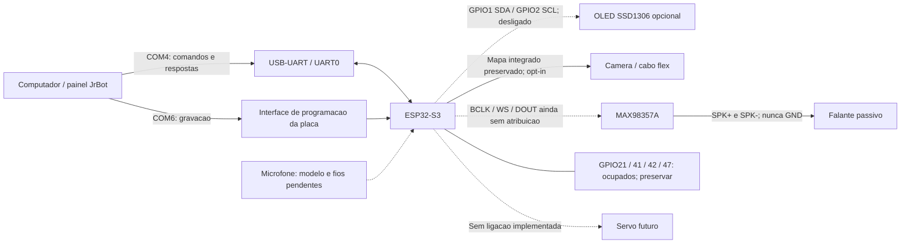

# JrBot - esquema de ligacao consolidado HW03

**Nao e ainda um esquema eletrico certificado da placa.** Este documento especifica todas as ligacoes conhecidas do projeto e marca expressamente as que faltam. Nao atribui uma funcao desconhecida aos GPIOs ocupados e nao substitui o esquema do fabricante.

Desligue TODAS as fontes, inclusive as duas USBs, antes de alterar fios ou o cabo flex. Se o OLED estiver danificado, deixe os quatro fios dele desconectados durante os testes dos demais modulos. Nao desconecte os circuitos existentes dos GPIOs 21, 41, 42 e 47.

## Visao geral

Linhas pontilhadas nao autorizam ligacao. Os conectores USB e sua topologia eletrica dependem da placa; os numeros COM sao os relatados pelo proprietario.

## 1. Placa e computador

| Rede | Origem | Destino | Observacao |
|---|---|---|---|
| PROGRAMACAO | USB de dados / COM6 | Conector de programacao usado nesta montagem | Gravar pelo roteiro; nao abrir monitor automaticamente |
| CONTROLE | USB de dados / COM4 | USB-UART associado a UART0 | O painel abre a COM4; nao abrir outro programa na mesma porta |
| UART0_TX/RX internos | GPIO43 / GPIO44 | Ponte USB-UART da propria placa | Reserva; nao adicionar fios externos nesses pinos |
| USB nativa | GPIO19 / GPIO20 | Circuito USB da placa | Reserva; nao reutilizar |

Nao una manualmente os 5 V de duas fontes USB nem a saida de uma fonte externa ao 5 V do computador sem verificar isolamento/backfeed no esquema da placa. Nao ha confirmacao de OR-ing ou protecao de alimentacao deste modelo.

## 2. OLED opcional

| Pino rotulado no modulo | Ligacao do projeto | Estado |
|---|---|---|
| SDA | GPIO1 | Reservado |
| SCL | GPIO2 | Reservado |
| GND | GND comum | Conectar somente com alimentacao desligada |
| VCC/VIN | 3V3 somente se o modulo confirmar suporte | Conferir modelo; nao mudar tensao no chute |

A ordem fisica dos quatro pinos varia entre modulos: seguir os rotulos, nao a ordem desta tabela. Os pull-ups de SDA/SCL devem terminar no nivel logico compativel com 3,3 V, nao em 5 V. O driver e SSD1306 128x64, I2C 100 kHz, enderecos testados 0x3C/0x3D. Ausencia de ACK nao prova queimadura. SH1106 exige implementacao propria.

## 3. Camera integrada

Nao refazer o cabo flex para seguir uma tabela generica. Manter o conector integrado e confirmar o modelo antes de habilitar o teste.

| Sinal | GPIO |
|---|---:|
| XCLK | 15 |
| SCCB SDA / SIOD | 4 |
| SCCB SCL / SIOC | 5 |
| D0 / D1 / D2 / D3 | 11 / 9 / 8 / 10 |
| D4 / D5 / D6 / D7 | 12 / 18 / 17 / 16 |
| VSYNC / HREF / PCLK | 6 / 7 / 13 |
| PWDN / RESET | -1: nenhum GPIO controlado pelo firmware |

Alimentacoes do sensor e ordem dos contatos FPC sao responsabilidade do circuito da placa. Nao ligar 3V3/5V diretamente a um sensor nu com base nesta tabela. O controlador SCCB usa I2C1 novo; clock XCLK usa LEDC timer0/canal0.

## 4. Amplificador MAX98357A e falante

**O mapa antigo foi cancelado. GPIO41 nao e mais saida de audio do JrBot.**

| Rede | Origem ESP32/fonte | Destino | Estado |
|---|---|---|---|
| AUDIO_BCLK | GPIO local configuravel, padrao -1 | BCLK do MAX98357A | Pendente |
| AUDIO_WS | GPIO local configuravel, padrao -1 | LRC/WS do MAX98357A | Pendente |
| AUDIO_DATA | GPIO local configuravel, padrao -1 | DIN do MAX98357A | Pendente |
| AUDIO_POWER | Ramal regulado compativel com o breakout | VIN/VDD do amplificador | Confirmar tensao/corrente |
| AUDIO_GND | GND da fonte e GND logico comum | GND do amplificador | Retorno de potencia fora dos fios de sinal |
| SPK_POS | OUT+/SPK+ do amplificador | Terminal do falante | Saida diferencial |
| SPK_NEG | OUT-/SPK- do amplificador | Outro terminal do falante | NAO e GND |
| SD/MODE | Configuracao do breakout | Habilitacao/selecao de canal | Sem GPIO atribuido; conferir resistores/straps |
| GAIN | Configuracao do breakout | Ganho analogico | Sem GPIO atribuido; consultar modulo |
| MCLK | Nenhuma ligacao requerida pelo MAX98357A | - | Nao inventar um fio adicional |

A proposta **BCLK39 / WS40 / DOUT14** evita as reservas declaradas no codigo, mas **NAO esta aprovada na placa nem ativada**. GPIO14 pode ter outro uso; GPIO39/40 exigem conferir JTAG externo. Os tres permanecem -1 no firmware por padrao. Se nao forem livres, nao habilitar a proposta.

O falante deve ficar ENTRE as duas saidas do amplificador. Nenhuma saida do falante vai a GND, GPIO ou entrada de outro amplificador. Nao use a saida em ponte como saida para fone de ouvido. Volume do primeiro teste: 10% pelo painel, nao reproduzir automaticamente ao ligar.

## 5. Microfone, servo e conexoes ja existentes

| Parte | Alimentacao | Sinais | Acao |
|---|---|---|---|
| Microfone | Desconhecida ate identificar modelo | I2S/PDM/analogico ainda desconhecido | Nao atribuir GPIO nem habilitar um driver generico |
| Servo | Fonte e corrente de pico ainda a definir | PWM sem GPIO | Nao mover; nenhum pino 42 reservado para servo |
| Circuito no GPIO21 | Ja conectado; funcao nao informada | Preservar | Identificar, nao reutilizar |
| Circuito no GPIO41 | Ja conectado; funcao nao informada | Preservar | Identificar, nao reutilizar |
| Circuito no GPIO42 | Ja conectado; funcao nao informada | Preservar | Identificar, nao reutilizar |
| Circuito no GPIO47 | Ja conectado; funcao nao informada | Preservar | Identificar, nao reutilizar |

Nao se pode deduzir que os quatro pinos pertencem ao microfone ou a um servo. Mesmo com o OLED desligado, GPIO1/2 permanecem reservados e nao viram substitutos de audio.

## 6. Alimentacao e revisao antes de energizar

A tensao e a corrente finais dependem dos modulos reais. Nao alimente potencia de servo/motor/falante por GPIO. O uso do regulador 3V3 da placa por cargas adicionais so pode ser aprovado apos conferir sua capacidade e a corrente total; nao foi aprovado aqui.

Somar consumo da placa (incluindo Wi-Fi/camera), amplificador no volume alvo e picos dos demais modulos; escolher fonte, protecao e cabos com margem medida. Isso nao autoriza alimentar tudo pela mesma USB sem conferir corrente e caminho de retorno. Manter GND comum para sinais, sem usar fios de sinal para retorno de potencia.

Antes do teste: verificar curtos com placa desligada, etiquetas/tensoes, polaridade, orientacao do flex, ausencia de fio novo nos quatro pinos ocupados e correspondencia entre fios e Kconfig. Depois confirmar no painel firmware DIAG-02; nenhum teste deve iniciar ao conectar.

## O que falta para tornar este esquema uma montagem final

Preencher `hardware/CONFIRMAR_MONTAGEM.txt`: placa (frente/verso), destinos dos quatro GPIOs ocupados, microfone, amplificador, falante e fonte. Ate la, as lacunas acima sao deliberadas e os testes permanecem bloqueados quando faltam dados. [Fontes tecnicas](FONTES.md).
