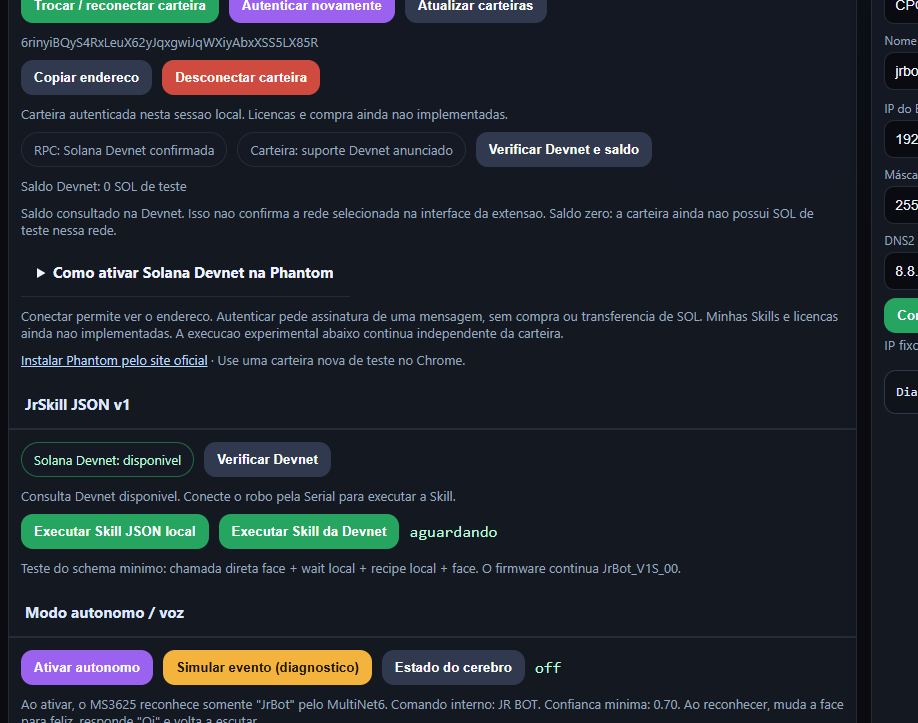

# Day 5 — wallet identity and License PDA model 00

Date: 2026-10-02. Work remains exclusively on `V1s-00`.

## Wallet evidence

The panel supports wallet selection, message-signature authentication and Devnet RPC/balance verification. Authentication proves control of the address during the local session; it does not issue a license or authorize payment.

User logs [connection (72)](assets/day5/jrskill-wallet-connection-log.txt), [authentication (73)](assets/day5/jrskill-wallet-auth-log.txt) and [Devnet RPC (74)](assets/day5/jrskill-wallet-devnet-log.txt) record the sequence. Log (74) verifies Devnet genesis and finalized balance queries for `6rinyiBQyS4RxLeuX62yJqxgwiJqWXiyAbxXSS5LX85R`, initially with zero balance. A later user screenshot shows 5 test SOL. This does not independently establish the network selected inside the extension.

## Commercial proof implemented locally

The existing JrSkill program now includes model 00 market configuration, creator-owned offers and buyer License PDAs. Upgrade authority protects initial configuration. Price transfers to the creator and treasury, plus license issuance, occur in one instruction. Configuration/offers are immutable through the current instructions. Purchases have a maximum accepted price and one license per buyer/Skill.

Anchor 1.1.2 compiled the SBF program and generated IDL in WSL. Six client tests, two IDL tests and two local-validator integration tests passed. Local purchases by A and B produced distinct licenses for the same Skill. A price of 100000001 lamports with 5000 bps commission paid 50000001 to the creator and 50000000 to the treasury. The buyer paid account rent; the test administrator paid network fees separately.

Unauthorized configuration/offers, duplicate purchases and invalid terms/recipients were rejected. Failed transactions were submitted to the local validator: failure during the second payment and failure in an instruction after a successful purchase both reverted the payments and license creation. Network fees remain separate.

The original JSON v1 and Skill account layout remain unchanged. A read-only finalized Devnet query at slot 506702089 confirmed the original 128-byte payload and hash `416d6af34eada998a5f46595e0355a5bdfd7dba86faefe312dbc2afcd26d907f`.

## Pending evidence

The commercial extension has **not been upgraded/deployed on Devnet**, and **no Devnet license purchase is claimed**. The Phantom balance is not purchase evidence. Purchase signing and license discovery/enforcement through the panel remain subsequent work. Firmware, Recipes and the existing physical execution flow were not changed.

Technical procedure/results: [License model 00 checkpoint](../JRSKILL_LICENSE_MODEL_00_TEST.md). Architecture: [License model 00](../JRSKILL_LICENSE_MODEL_00.md). Commercial history: [Issue #46](https://github.com/JuniorNarciso26/JrRobot/issues/46); technical history: [Issue #33](https://github.com/JuniorNarciso26/JrRobot/issues/33).
