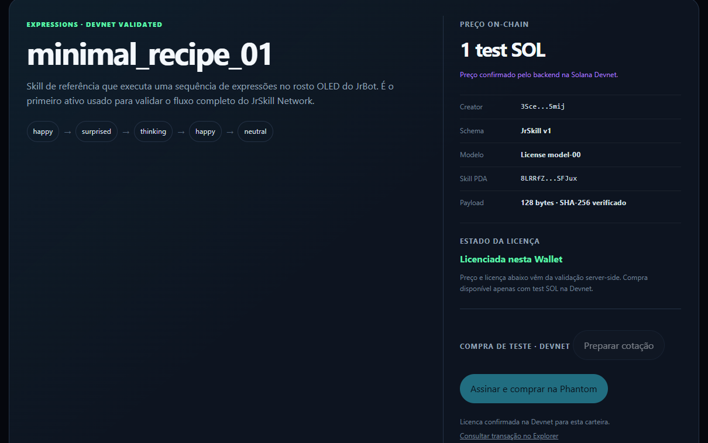
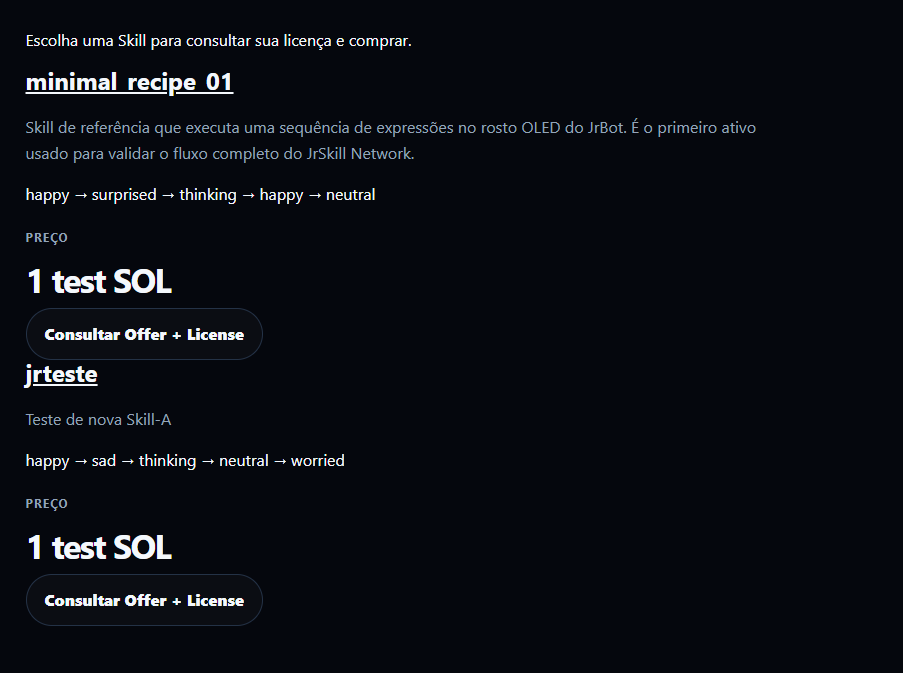
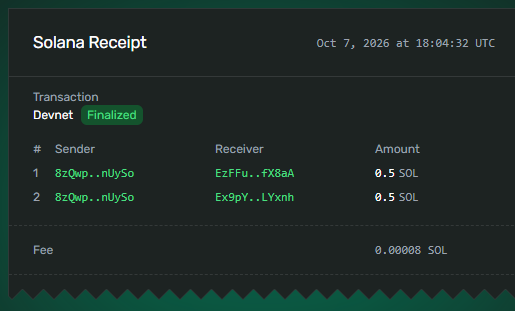
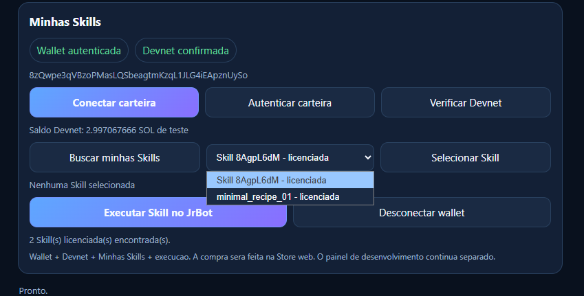
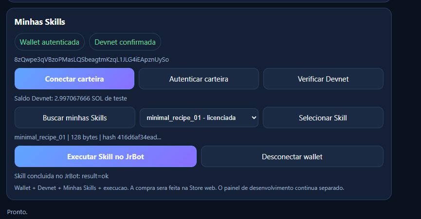
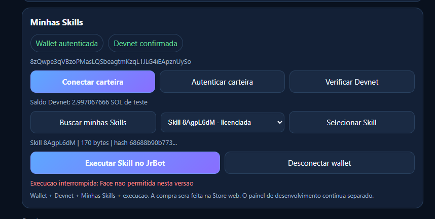
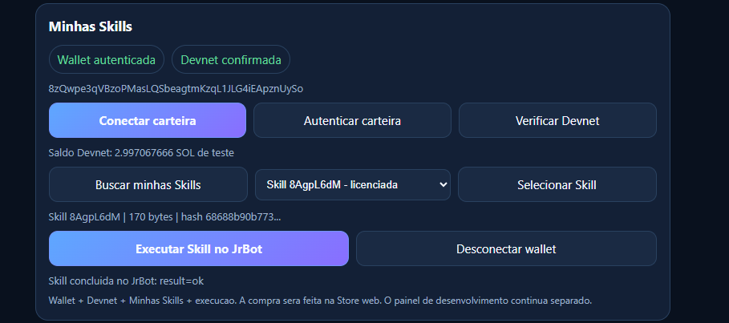

# Day 8 — public JrSkill Store, Creator Studio and generic physical Skills

Date: 2026-10-07. Firmware line: `V1s-00`. Solana Devnet/test SOL.

## Goal

Turn the previous one-Skill technical proof into a reusable product flow:

```text
developer
  -> creates a JrSkill
  -> publishes through the public Store
  -> Skill + Offer on Solana Devnet
  -> another wallet buys a License
  -> JrBot discovers the licensed Skill
  -> user selects it
  -> physical execution
```

Day 8 also starts the external-contributor pilot after the internal end-to-end flow was proven with a second Skill.

## JrSkill Store — from catalogue to public purchase

The Store evolved in the separate `JrBot_Web` repository while the Store API remained in `JrBot_Cloud`.

Architecture:

```text
JrBot_Web
  -> public Store / Wallet Standard
  -> HTTPS

JrBot_Cloud
  -> Store API
  -> quote / validation / relay / License state

Solana Devnet
  -> Skill
  -> Offer
  -> License

JrBot / V1s-00
  -> Minhas Skills
  -> safe physical execution
```

### Store milestones completed

- bilingual catalogue at `/pt/store/` and `/en/store/`;
- Phantom / Wallet Standard authentication;
- Devnet balance and finalized Offer/License reads;
- explicit quote and user acceptance before purchase;
- signed transaction validation in the backend;
- bounded ComputeBudget compatibility;
- persistent handling for ambiguous `unknown/submitted` attempts;
- manual review/close flow without automatic retry;
- public API deployed by the user on a VPS behind HTTPS;
- public frontend promoted to `main`;
- CSP corrected to allow the Store to reach `https://api.jrbot.com.br`.

The public API health endpoint was confirmed on Devnet before the Store frontend test.

## First public Store purchase + physical JrBot validation

The user completed a real purchase from the **public Store** with Phantom.

Transaction:

```text
4KVAAo9osfgFBBLpdkvzM5wrDKujckSUjQBrvu1PQ7vWQnk6ruMEzuh9BvneVWbHRBJfD5hEYkKkAcm2mDmwHiSs
```

Verified state:

- finalized, `err=null`;
- slot **508514804**;
- buyer `EzFFu5XgUXBcRpkUKuNPJQoAfnueCBLrAKhHi54fX8aA`;
- License `GkxVHAcVPD1yJWiCpy5bF3o4Dokb8Vx9iSRM49Mi9Upd`;
- price: **1 test SOL**;
- creator: **0.5 test SOL**;
- JrBot treasury: **0.5 test SOL**;
- License deposit: **0.0013462 test SOL**;
- effective fee: **0.00008 test SOL**.

The user then confirmed the purchased License worked on the physical JrBot.

This validates:

```text
public Store
  -> Phantom
  -> public HTTPS API
  -> Solana Devnet
  -> License
  -> JrBot
  -> physical Skill execution
```

This is Devnet/test SOL only; it is not a Mainnet claim.

## Creator Studio — publish a new Skill from the website

The Store then gained **Create your Skill / Crie sua Skill**, allowing a creator to build a declarative OLED-expression Skill and publish it from the website.

The API 0.3.0 flow creates the Skill and Offer on Devnet and makes the published Skill discoverable in the public catalogue after finalized verification.

The user created the second Skill:

```text
name: jrteste
Skill PDA: 8AgpL6dMgSc33oEpkWrpT6efEVAgPXRZt2Grd1TUAoYM
payload: 170 bytes
SHA-256: 68688b90b77349b2f067352b0cfbbdb0a8a445dc63147d47b8d9a4c7836ed011
sequence: happy -> sad -> thinking -> neutral -> worried
```

Creation transaction:

```text
3sXFxUjrh5ACADGEx3oXtZerkAZR4U8TQEnsJxSXtmyezkSNiVbKprvNYhaezTQhUb4bVBkMmbhWWt7A3oQftq1A
```

The catalogue/detail cache issue found during this test was corrected and the public Store then displayed the selected `jrteste` metadata, creator, sequence, payload size and hash correctly.

## Second Skill purchase — real creator revenue split

A different wallet bought `jrteste` from the Store.

Transaction:

```text
4VGJAhSuE9ocEG4V2Gw1UjeyvjVEKocXYCm5di3d5A5GBhSD4VGt9trEyEj2pYvHWGyM3M2Ux3x9Zf6pB9MA634s
```

Verified state:

- finalized, `err=null`;
- slot **508539183**;
- buyer `8zQwpe3qVBzoPMasLQSbeagtmKzqL1JLG4iEApznUySo`;
- License `9P3st294MvcKHvcz6zxpiPZUUdQYmb8xxwYCv6edV27w`;
- creator received **0.5 test SOL**;
- treasury received **0.5 test SOL**;
- effective fee **0.00008 test SOL**;
- total buyer debit **1.0014262 test SOL**.

This proves the Store path with a Skill created through the new Creator Studio, not only the historical reference Skill.

## Visual evidence — user-supplied test screenshots

These original screenshots were supplied by the maintainer during the Day 8 tests on 2026-10-07 and added to the diary on 2026-10-08. They document the visible Store/App states and transaction receipt. Physical robot behavior was confirmed separately by the maintainer; an App success message alone is not a video of the hardware.

### 1. Public Store purchase: License confirmed

The public Store displays **Licenciada nesta Wallet** after the reference Skill purchase. The screenshot includes the Devnet price and License confirmation.



[Public Store purchase transaction on Solana Devnet](https://explorer.solana.com/tx/4KVAAo9osfgFBBLpdkvzM5wrDKujckSUjQBrvu1PQ7vWQnk6ruMEzuh9BvneVWbHRBJfD5hEYkKkAcm2mDmwHiSs?cluster=devnet).

### 2. Creator Studio output appears in the catalogue

The catalogue contains both `minimal_recipe_01` and the newly created `jrteste`, with its description and `happy -> sad -> thinking -> neutral -> worried` sequence. This capture also records the intermediate layout/detail-link issue reported at that time; it is not a screenshot of the corrected final catalogue layout.



[jrteste creation transaction on Solana Devnet](https://explorer.solana.com/tx/3sXFxUjrh5ACADGEx3oXtZerkAZR4U8TQEnsJxSXtmyezkSNiVbKprvNYhaezTQhUb4bVBkMmbhWWt7A3oQftq1A?cluster=devnet).

### 3. Another wallet purchases jrteste: 50/50 split

The finalized Devnet receipt shows two transfers of **0.5 test SOL**: one to the creator (`EzFFu...fX8aA`) and one to the JrBot treasury (`Ex9pY...LYxnh`). The receipt shows an effective fee of **0.00008 test SOL**. The full addresses and verified transaction state are recorded above.



[jrteste purchase transaction on Solana Devnet](https://explorer.solana.com/tx/4VGJAhSuE9ocEG4V2Gw1UjeyvjVEKocXYCm5di3d5A5GBhSD4VGt9trEyEj2pYvHWGyM3M2Ux3x9Zf6pB9MA634s?cluster=devnet).

### 4. Buyer discovers two licensed Skills

The authenticated buyer's App lists both `minimal_recipe_01` and `Skill 8AgpL6dM` as licensed, and reports **2 Skill(s) licenciada(s) encontrada(s)**. The PDA-prefix label identifies `jrteste`; the image does not imply its catalogue name had already been resolved in the App.



### 5. Reference Skill completes execution

The selected `minimal_recipe_01` shows **128 bytes**, hash prefix **416d6af34ead...**, and **Skill concluida no JrBot: result=ok**.



### 6. Compatibility incident before APP_03

The first `jrteste` execution attempt shows the correct **170-byte** payload and hash prefix **68688b90b773...**, but stops with **Execucao interrompida: Face nao permitida nesta versao**. This is the failure that motivated the allowlist and pre-validation correction described below.



### 7. New Skill completes execution after the correction

After installing APP_03, the App selects the same `Skill 8AgpL6dM`, retains the **170-byte** payload and matching hash prefix, and displays **Skill concluida no JrBot: result=ok**. The maintainer also confirmed the physical behavior and development-panel execution. A separate post-fix panel screenshot was not supplied in this conversation.



These images are stored in the repository so the diary's evidence does not depend on temporary clipboard paths.

## Generic publisher and onboarding path

The Devnet publisher/read tools in `V1s-00` were generalized so they can receive an arbitrary JrSkill JSON v1 file while keeping the old reference file as a compatibility fallback.

Documentation was added for a first author to create and publish a Skill without depending on the historical `minimal_recipe_01` payload.

The internal author pilot was intentionally used before inviting external developers.

## APP_03 / SKILLS-15 — generic licensed Skill execution

The first attempt to run `jrteste` exposed a real compatibility bug: the embedded App still allowed only four face expressions even though the firmware face module supported more.

The fix produced:

```text
Firmware: JrBot_V1S_APP_03
Panel: JRBOT-PANEL-V1S-SKILLS-15
```

Changes:

- App face allowlist aligned with the current OLED expressions;
- `sad` and `worried` supported for the pilot;
- the complete Skill document is validated before the first Runtime API command;
- panel can explicitly select a licensed Skill PDA;
- generic reader validates owner, discriminator, schema, size, hash and derived Skill PDA;
- execution permit is tied to session, buyer and selected Skill;
- finalized License state is checked before physical commands;
- purchases remain outside the robot App.

### Automated / build validation

Recorded for APP_03:

- **43 Python tests passed**;
- **33 JavaScript tests passed**;
- **6 panel policy checks passed**;
- real Devnet read of `jrteste`: 170 bytes, hash verified;
- ESP-IDF 5.5.5 compilation for ESP32-S3 completed;
- firmware binary: **2,193,216 bytes (0x217740)**;
- approximately **58%** free in the application partition.

## Physical validation — second independent Skill

The user installed APP_03 and tested `jrteste`.

Confirmed by the user:

- Wallet authenticated;
- Devnet confirmed;
- `jrteste` licensed and selectable;
- payload **170 bytes**;
- hash prefix **68688b90b773...**;
- physical execution completed in the embedded App with **`result=ok`**;
- the same Skill also executed through the development panel.

This closes the internal second-Skill pilot:

```text
Creator Studio
  -> public catalogue
  -> Skill + Offer
  -> purchase by another wallet
  -> License
  -> discovery
  -> selection
  -> physical JrBot execution
```

No patch specific to the name `jrteste` was required in the on-chain payload.

## External pilot opened

With the internal pipeline proven, the project opened the first external JrSkill pilot.

Tracking:

- [Traction / Developer Challenge #52](https://github.com/JuniorNarciso26/JrRobot/issues/52)
- [External invitation #53](https://github.com/JuniorNarciso26/JrRobot/issues/53)
- [Portuguese pilot guide](../JRSKILL_PILOT.md)
- [Build your first JrSkill](../JRSKILL_FIRST_SKILL.md)

Initial target: **3 external contributors**.

Participants may:

- publish through the Store with Phantom and Devnet test SOL; or
- submit an original JrSkill JSON v1 for assisted publication.

A contributor does **not** need to own a JrBot. The maintainer can run the submitted Skill on the physical robot and record the result with the contributor's chosen attribution.

No external contributor is claimed yet.

## Current pilot boundary

For the first external round, use the six physically exercised expressions:

```text
happy
sad
surprised
thinking
worried
neutral
```

A `battery` / `battery_low` alias mismatch was identified between the Creator Studio and APP_03 pre-validation. It is recorded as a compatibility item and is **not** treated as validated by the `jrteste` test.

The publisher CLI's separate `npm test` checklist item also remains explicitly open in the traction issue; the completed Web route does not silently close that item.

## Day 8 closure

Day 8 converts JrSkill Network from a single reference-Skill proof into a reusable end-to-end creator/buyer/robot pipeline on Devnet.

Validated today:

```text
Create a Skill on the web
        +
Publish Skill + Offer on Solana
        +
List it in the public Store
        +
Buy with another Phantom wallet
        +
50/50 creator / JrBot test-SOL split
        +
Discover licensed Skill
        +
Select generic Skill
        +
Run it on a physical JrBot
```

The next validation is intentionally **external**: a contributor outside the core development flow creates/submits a Skill and receives a recorded physical result.

## Colosseum update — ready-to-publish draft

**Day 8 — JrSkill is now a reusable creator-to-robot pipeline.**

Today we moved beyond our original reference Skill. The public JrSkill Store is live on Devnet with Phantom, HTTPS backend, real License purchases and physical JrBot execution.

We also launched the first Creator Studio. A new Skill, `jrteste`, was created from the website, published with its Offer on Solana Devnet, listed in the public catalogue and purchased by a different wallet. The 1 test SOL purchase split 50/50 between the Skill creator and JrBot treasury.

That new licensed Skill was then discovered and selected by `JrBot_V1S_APP_03` and executed successfully on the physical robot with `result=ok`. This forced us to remove the old reference-Skill assumptions and generalize the App/panel execution path.

With the internal second-Skill pipeline proven, we opened the first external JrSkill pilot: developers can create a Skill on Devnet or submit JSON, even without owning a JrBot. We can run their Skill on a physical robot and publish the result with their credit.

Next milestone: the first external contributor.
